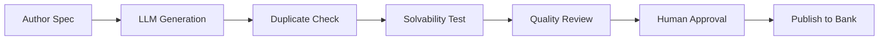

# CO-005: Problem Authoring Pipeline with LLM Assistance

**Priority**: P1 - High  
**Type**: Feature  
**Component**: Content Pipeline  
**Estimated Effort**: 8-10 hours  
**Dependencies**: CO-002

## Objective

Build a secure, quality-controlled pipeline for authoring new problems with LLM assistance, including validation, duplicate detection, and automated quality assurance.

## Background

Per the design document, we need a pipeline that:
1. Uses LLMs to generate problem variants and test cases
2. Validates problems for solvability and uniqueness
3. Detects near-duplicates to avoid repetition
4. Ensures no copyrighted content leakage
5. Maintains provenance and licensing metadata

## High-Level Design

### Pipeline Architecture
```
ProblemAuthoringPipeline
    ├── SpecValidator           # Validate author intent spec
    ├── LLMGenerator           # Generate variants and tests
    ├── DuplicateDetector      # Embedding-based similarity
    ├── SolvabilityChecker     # Execute reference solutions
    ├── QualityAssurance       # Comprehensive validation
    ├── ContentSanitizer       # Remove protected content
    └── ProblemPublisher       # Finalize and store
```

### Workflow


## Implementation Details

### 1. Problem Spec Schema
Create `src/co/schemas/problem_authoring.py`:
```python
from pydantic import BaseModel, Field, validator
from typing import List, Optional, Dict, Any
from enum import Enum

class DifficultyLevel(int, Enum):
    EASY = 1
    MEDIUM = 2
    HARD = 3
    EXPERT = 4
    EXTREME = 5

class ComplexityTarget(str, Enum):
    CONSTANT = "O(1)"
    LOGARITHMIC = "O(log n)"
    LINEAR = "O(n)"
    LINEARITHMIC = "O(n log n)"
    QUADRATIC = "O(n^2)"
    CUBIC = "O(n^3)"
    EXPONENTIAL = "O(2^n)"

class ProblemIntentSpec(BaseModel):
    """Author's specification for problem generation"""
    
    title: str = Field(..., min_length=5, max_length=100)
    pattern: str = Field(..., description="Algorithm pattern (e.g., sliding-window)")
    topics: List[str] = Field(..., min_items=1, max_items=5)
    difficulty: DifficultyLevel
    time_complexity_target: ComplexityTarget
    space_complexity_target: ComplexityTarget
    
    constraints: Dict[str, Any] = Field(
        ...,
        description="Problem constraints (e.g., array size, value ranges)"
    )
    
    target_pitfalls: List[str] = Field(
        default=[],
        description="Common mistakes to test for"
    )
    
    similar_to: Optional[str] = Field(
        None,
        description="Reference problem for style (not content)"
    )
    
    avoid_concepts: List[str] = Field(
        default=[],
        description="Concepts to avoid in generation"
    )
    
    @validator('constraints')
    def validate_constraints(cls, v):
        required = ['min_n', 'max_n']
        for key in required:
            if key not in v:
                raise ValueError(f"Missing required constraint: {key}")
        return v

class GeneratedProblem(BaseModel):
    """LLM-generated problem content"""
    
    statement: str
    examples: List[Dict[str, Any]]
    constraints: List[str]
    
    visible_tests: List[Dict[str, Any]]
    hidden_test_categories: List[str]
    
    hints: Dict[str, str]  # L1, L2, L3
    solution_approach: str
    
    time_complexity: str
    space_complexity: str
    
    metadata: Dict[str, Any]
```

### 2. LLM Generator Service
Create `src/co/services/problem_generator.py`:
```python
import hashlib
from typing import List, Dict, Any
from openai import AsyncOpenAI
from ..schemas.problem_authoring import ProblemIntentSpec, GeneratedProblem
import json

class ProblemGenerator:
    """Generate problems using LLM with safety controls"""
    
    def __init__(self, api_key: str):
        self.client = AsyncOpenAI(api_key=api_key)
        self.generation_prompt_template = """
You are a programming problem author. Generate a UNIQUE problem based on this spec:

Pattern: {pattern}
Topics: {topics}
Difficulty: {difficulty}/5
Target Complexity: Time {time_complexity}, Space {space_complexity}
Constraints: {constraints}
Pitfalls to test: {pitfalls}

Requirements:
1. Create an ORIGINAL problem - do not copy existing problems
2. Make it practical and realistic
3. Include 3-4 examples with explanations
4. Design test cases that catch the specified pitfalls
5. Provide hints at 3 levels (subtle → moderate → explicit)
6. Avoid these concepts: {avoid_concepts}

Output as JSON:
{{
    "statement": "problem description",
    "examples": [...],
    "constraints": [...],
    "visible_tests": [...],
    "hidden_test_categories": [...],
    "hints": {{"L1": "...", "L2": "...", "L3": "..."}},
    "solution_approach": "...",
    "time_complexity": "...",
    "space_complexity": "..."
}}
"""
    
    async def generate_variants(
        self, 
        spec: ProblemIntentSpec,
        num_variants: int = 3
    ) -> List[GeneratedProblem]:
        """Generate multiple problem variants from spec"""
        
        variants = []
        
        for i in range(num_variants):
            # Add variation seed to prompt
            prompt = self.generation_prompt_template.format(
                pattern=spec.pattern,
                topics=", ".join(spec.topics),
                difficulty=spec.difficulty,
                time_complexity=spec.time_complexity_target,
                space_complexity=spec.space_complexity_target,
                constraints=json.dumps(spec.constraints),
                pitfalls=", ".join(spec.target_pitfalls),
                avoid_concepts=", ".join(spec.avoid_concepts)
            )
            
            prompt += f"\nVariation seed: {i+1}/{num_variants} - ensure this is distinctly different."
            
            response = await self.client.chat.completions.create(
                model="gpt-4",
                messages=[
                    {"role": "system", "content": "You are an expert problem author."},
                    {"role": "user", "content": prompt}
                ],
                temperature=0.8,  # Some creativity
                response_format={"type": "json_object"}
            )
            
            problem_data = json.loads(response.choices[0].message.content)
            problem = GeneratedProblem(**problem_data)
            
            # Add generation metadata
            problem.metadata = {
                "generator_version": "1.0",
                "spec_hash": hashlib.sha256(spec.json().encode()).hexdigest(),
                "variant_index": i
            }
            
            variants.append(problem)
        
        return variants
    
    async def generate_test_cases(
        self,
        problem: GeneratedProblem,
        num_hidden: int = 20
    ) -> Dict[str, List[Dict]]:
        """Generate comprehensive test cases"""
        
        prompt = f"""
Given this problem:
{problem.statement}

Generate {num_hidden} hidden test cases covering these categories:
{', '.join(problem.hidden_test_categories)}

Include:
- Edge cases (empty, single element, max size)
- Boundary values
- Cases that trigger common mistakes
- Performance tests (large inputs)
- Random valid inputs

Output as JSON:
{{
    "hidden_tests": [
        {{"input": {{...}}, "expected": ..., "category": "..."}},
        ...
    ]
}}
"""
        
        response = await self.client.chat.completions.create(
            model="gpt-4",
            messages=[{"role": "user", "content": prompt}],
            temperature=0.3,  # More deterministic for tests
            response_format={"type": "json_object"}
        )
        
        return json.loads(response.choices[0].message.content)
```

### 3. Duplicate Detection Service
Create `src/co/services/duplicate_detector.py`:
```python
import numpy as np
from sentence_transformers import SentenceTransformer
from typing import List, Tuple
import faiss
from sqlalchemy.orm import Session
from ..db.models import Problem

class DuplicateDetector:
    """Detect near-duplicate problems using embeddings"""
    
    def __init__(self, model_name: str = "all-MiniLM-L6-v2"):
        self.model = SentenceTransformer(model_name)
        self.index = None
        self.problem_ids = []
        
    def build_index(self, db: Session):
        """Build FAISS index from existing problems"""
        
        problems = db.query(Problem).all()
        
        if not problems:
            return
        
        # Generate embeddings for all problems
        texts = [p.statement for p in problems]
        embeddings = self.model.encode(texts)
        
        # Build FAISS index
        dimension = embeddings.shape[1]
        self.index = faiss.IndexFlatL2(dimension)
        self.index.add(embeddings.astype('float32'))
        
        self.problem_ids = [p.id for p in problems]
    
    def find_similar(
        self, 
        statement: str,
        threshold: float = 0.85,
        top_k: int = 5
    ) -> List[Tuple[str, float]]:
        """Find similar problems to the given statement"""
        
        if not self.index:
            return []
        
        # Generate embedding
        embedding = self.model.encode([statement])
        
        # Search index
        distances, indices = self.index.search(
            embedding.astype('float32'), 
            min(top_k, len(self.problem_ids))
        )
        
        # Convert distances to similarities (1 - normalized_distance)
        similarities = 1 - (distances[0] / distances[0].max())
        
        # Filter by threshold
        similar = []
        for idx, sim in zip(indices[0], similarities):
            if sim >= threshold:
                similar.append((self.problem_ids[idx], float(sim)))
        
        return similar
    
    def is_duplicate(
        self,
        statement: str,
        threshold: float = 0.9
    ) -> bool:
        """Check if statement is too similar to existing problems"""
        
        similar = self.find_similar(statement, threshold, 1)
        return len(similar) > 0
```

### 4. Solvability Checker
Create `src/co/services/solvability_checker.py`:
```python
import asyncio
import subprocess
from typing import Dict, Any, Optional
import tempfile
import os

class SolvabilityChecker:
    """Verify problems are solvable within constraints"""
    
    def __init__(self, eval_service_url: str):
        self.eval_url = eval_service_url
        
    async def check_reference_solution(
        self,
        problem: GeneratedProblem,
        reference_code: str,
        language: str = "python",
        timeout_ms: int = 5000
    ) -> Dict[str, Any]:
        """Run reference solution against all tests"""
        
        results = {
            "solvable": False,
            "visible_passed": 0,
            "visible_total": len(problem.visible_tests),
            "performance": {},
            "errors": []
        }
        
        # Test visible cases
        for test in problem.visible_tests:
            try:
                result = await self._run_test(
                    reference_code,
                    language,
                    test,
                    timeout_ms
                )
                
                if result["passed"]:
                    results["visible_passed"] += 1
                else:
                    results["errors"].append(f"Failed on input: {test['input']}")
                    
                # Track performance
                if "exec_ms" in result:
                    input_size = self._estimate_input_size(test["input"])
                    results["performance"][input_size] = result["exec_ms"]
                    
            except Exception as e:
                results["errors"].append(str(e))
        
        results["solvable"] = results["visible_passed"] == results["visible_total"]
        
        # Estimate complexity from performance data
        if len(results["performance"]) >= 3:
            results["estimated_complexity"] = self._estimate_complexity(
                results["performance"]
            )
        
        return results
    
    async def stress_test(
        self,
        problem: GeneratedProblem,
        reference_code: str,
        language: str = "python"
    ) -> Dict[str, Any]:
        """Generate and run stress tests"""
        
        stress_tests = await self._generate_stress_tests(problem)
        
        results = {
            "passed": 0,
            "total": len(stress_tests),
            "max_time_ms": 0,
            "max_memory_mb": 0
        }
        
        for test in stress_tests:
            result = await self._run_test(
                reference_code,
                language,
                test,
                timeout_ms=10000
            )
            
            if result["passed"]:
                results["passed"] += 1
            
            results["max_time_ms"] = max(
                results["max_time_ms"],
                result.get("exec_ms", 0)
            )
            results["max_memory_mb"] = max(
                results["max_memory_mb"],
                result.get("memory_mb", 0)
            )
        
        return results
    
    def _estimate_complexity(self, performance: Dict[int, float]) -> str:
        """Estimate algorithmic complexity from performance data"""
        
        # Sort by input size
        points = sorted(performance.items())
        
        if len(points) < 3:
            return "unknown"
        
        # Calculate ratios between consecutive points
        ratios = []
        for i in range(1, len(points)):
            n1, t1 = points[i-1]
            n2, t2 = points[i]
            
            if n1 > 0 and t1 > 0:
                # How does time scale with input size?
                size_ratio = n2 / n1
                time_ratio = t2 / t1
                ratios.append((size_ratio, time_ratio))
        
        # Classify based on ratios
        avg_time_ratio = np.mean([r[1] for r in ratios])
        avg_size_ratio = np.mean([r[0] for r in ratios])
        
        if avg_time_ratio < 1.5:
            return "O(1)"
        elif avg_time_ratio < avg_size_ratio * 0.5:
            return "O(log n)"
        elif avg_time_ratio < avg_size_ratio * 1.5:
            return "O(n)"
        elif avg_time_ratio < avg_size_ratio * avg_size_ratio * 1.5:
            return "O(n^2)"
        else:
            return "O(n^3)"
    
    async def _run_test(
        self,
        code: str,
        language: str,
        test: Dict,
        timeout_ms: int
    ) -> Dict[str, Any]:
        """Execute code with single test case"""
        
        # Call eval service
        async with httpx.AsyncClient() as client:
            response = await client.post(
                f"{self.eval_url}/execute",
                json={
                    "code": code,
                    "language": language,
                    "test": test,
                    "timeout_ms": timeout_ms
                }
            )
            return response.json()
    
    def _estimate_input_size(self, input_data: Any) -> int:
        """Estimate the 'n' for complexity analysis"""
        
        if isinstance(input_data, list):
            return len(input_data)
        elif isinstance(input_data, dict):
            # Assume first list parameter is primary input
            for v in input_data.values():
                if isinstance(v, list):
                    return len(v)
        return 1
    
    async def _generate_stress_tests(
        self,
        problem: GeneratedProblem
    ) -> List[Dict]:
        """Generate large input tests"""
        
        # This would use the constraints to generate max-size inputs
        # Simplified version:
        return [
            {"input": {"n": 1000}, "category": "stress_medium"},
            {"input": {"n": 10000}, "category": "stress_large"},
            {"input": {"n": 100000}, "category": "stress_max"}
        ]
```

### 5. Quality Assurance Pipeline
Create `src/co/services/quality_assurance.py`:
```python
from typing import Dict, List, Any
import re

class QualityAssurance:
    """Comprehensive quality checks for generated problems"""
    
    # Known copyrighted problem titles/phrases to avoid
    PROTECTED_PHRASES = [
        "leetcode", "hackerrank", "codeforces",
        "topcoder", "codechef", "atcoder"
    ]
    
    def validate_problem(
        self,
        problem: GeneratedProblem,
        spec: ProblemIntentSpec
    ) -> Dict[str, Any]:
        """Run all quality checks"""
        
        results = {
            "valid": True,
            "issues": [],
            "warnings": [],
            "score": 100
        }
        
        # Check for protected content
        if self._has_protected_content(problem):
            results["valid"] = False
            results["issues"].append("Contains protected/copyrighted content")
            results["score"] -= 50
        
        # Validate complexity alignment
        if not self._complexity_matches(problem, spec):
            results["warnings"].append("Complexity doesn't match specification")
            results["score"] -= 10
        
        # Check problem clarity
        clarity_issues = self._check_clarity(problem)
        if clarity_issues:
            results["warnings"].extend(clarity_issues)
            results["score"] -= len(clarity_issues) * 5
        
        # Validate test coverage
        coverage_issues = self._check_test_coverage(problem)
        if coverage_issues:
            results["issues"].extend(coverage_issues)
            results["score"] -= len(coverage_issues) * 10
        
        # Check hints quality
        hint_issues = self._check_hints(problem)
        if hint_issues:
            results["warnings"].extend(hint_issues)
            results["score"] -= len(hint_issues) * 3
        
        results["valid"] = results["score"] >= 60 and not results["issues"]
        
        return results
    
    def _has_protected_content(self, problem: GeneratedProblem) -> bool:
        """Check for copyrighted content"""
        
        text = problem.statement.lower()
        
        for phrase in self.PROTECTED_PHRASES:
            if phrase in text:
                return True
        
        # Check for exact problem title matches (would query external DB)
        # Simplified version:
        suspicious_patterns = [
            r"problem \d+",  # "Problem 42" style
            r"easy/medium/hard #\d+",  # Difficulty + number
        ]
        
        for pattern in suspicious_patterns:
            if re.search(pattern, text, re.IGNORECASE):
                return True
        
        return False
    
    def _complexity_matches(
        self,
        problem: GeneratedProblem,
        spec: ProblemIntentSpec
    ) -> bool:
        """Verify complexity aligns with specification"""
        
        return (
            problem.time_complexity == spec.time_complexity_target and
            problem.space_complexity == spec.space_complexity_target
        )
    
    def _check_clarity(self, problem: GeneratedProblem) -> List[str]:
        """Check problem statement clarity"""
        
        issues = []
        
        # Check statement length
        word_count = len(problem.statement.split())
        if word_count < 50:
            issues.append("Statement too brief (< 50 words)")
        elif word_count > 500:
            issues.append("Statement too long (> 500 words)")
        
        # Check for ambiguity markers
        ambiguous = ["might", "maybe", "possibly", "could be"]
        for word in ambiguous:
            if word in problem.statement.lower():
                issues.append(f"Ambiguous language: '{word}'")
        
        # Check examples
        if len(problem.examples) < 2:
            issues.append("Insufficient examples (need at least 2)")
        
        # Check constraints clarity
        if not problem.constraints:
            issues.append("Missing explicit constraints")
        
        return issues
    
    def _check_test_coverage(self, problem: GeneratedProblem) -> List[str]:
        """Validate test case coverage"""
        
        issues = []
        
        # Check visible tests
        if len(problem.visible_tests) < 2:
            issues.append("Too few visible tests")
        
        # Check test categories
        required_categories = ["edge_case", "normal", "large"]
        missing = set(required_categories) - set(problem.hidden_test_categories)
        
        if missing:
            issues.append(f"Missing test categories: {missing}")
        
        return issues
    
    def _check_hints(self, problem: GeneratedProblem) -> List[str]:
        """Validate hint quality and progression"""
        
        issues = []
        
        if not all(k in problem.hints for k in ["L1", "L2", "L3"]):
            issues.append("Missing hint levels")
            return issues
        
        # Check hint progression (each should be more explicit)
        l1_len = len(problem.hints["L1"])
        l2_len = len(problem.hints["L2"])
        l3_len = len(problem.hints["L3"])
        
        if not (l1_len < l2_len < l3_len):
            issues.append("Hints don't show proper progression")
        
        # Check for solution leakage in early hints
        solution_keywords = ["code", "implementation", "solution"]
        if any(kw in problem.hints["L1"].lower() for kw in solution_keywords):
            issues.append("L1 hint reveals too much")
        
        return issues
```

### 6. Authoring API
Create `src/co/routes/authoring.py`:
```python
from fastapi import APIRouter, Depends, HTTPException, BackgroundTasks
from ..schemas.problem_authoring import ProblemIntentSpec
from ..services.problem_generator import ProblemGenerator
from ..services.duplicate_detector import DuplicateDetector
from ..services.solvability_checker import SolvabilityChecker
from ..services.quality_assurance import QualityAssurance
from ..auth import require_role

router = APIRouter()

@router.post("/author/generate")
async def generate_problem_variants(
    spec: ProblemIntentSpec,
    background_tasks: BackgroundTasks,
    user=Depends(require_role("content_author"))
):
    """Generate problem variants from specification"""
    
    # Initialize services
    generator = ProblemGenerator(settings.OPENAI_API_KEY)
    
    # Generate variants
    variants = await generator.generate_variants(spec, num_variants=3)
    
    # Schedule quality checks in background
    for i, variant in enumerate(variants):
        background_tasks.add_task(
            validate_and_store_problem,
            variant,
            spec,
            user.id,
            f"variant_{i}"
        )
    
    return {
        "message": "Generating 3 variants",
        "spec_id": spec.dict()["title"],
        "variants_count": len(variants)
    }

@router.post("/author/validate")
async def validate_problem(
    problem_id: str,
    user=Depends(require_role("content_author"))
):
    """Run full validation pipeline on a problem"""
    
    # Load problem
    problem = await get_problem(problem_id)
    
    # Run checks
    duplicate_detector = DuplicateDetector()
    duplicate_detector.build_index(db)
    
    is_duplicate = duplicate_detector.is_duplicate(problem.statement)
    if is_duplicate:
        return {"valid": False, "reason": "Too similar to existing problem"}
    
    # Check solvability
    checker = SolvabilityChecker(settings.EVAL_BASE)
    solvability = await checker.check_reference_solution(
        problem,
        problem.reference_solution,
        problem.language
    )
    
    if not solvability["solvable"]:
        return {
            "valid": False,
            "reason": "Reference solution fails",
            "errors": solvability["errors"]
        }
    
    # Quality assurance
    qa = QualityAssurance()
    qa_results = qa.validate_problem(problem, problem.spec)
    
    return {
        "valid": qa_results["valid"],
        "score": qa_results["score"],
        "issues": qa_results["issues"],
        "warnings": qa_results["warnings"]
    }

@router.get("/author/review-queue")
async def get_review_queue(
    status: str = "pending",
    user=Depends(require_role("content_reviewer"))
):
    """Get problems awaiting review"""
    
    problems = await get_problems_by_status(status)
    
    return {
        "items": [
            {
                "id": p.id,
                "title": p.title,
                "author": p.author_id,
                "created_at": p.created_at,
                "qa_score": p.qa_score,
                "status": p.status
            }
            for p in problems
        ]
    }

@router.post("/author/approve/{problem_id}")
async def approve_problem(
    problem_id: str,
    feedback: str = None,
    user=Depends(require_role("content_reviewer"))
):
    """Approve problem for publication"""
    
    problem = await get_problem(problem_id)
    problem.status = "approved"
    problem.reviewed_by = user.id
    problem.review_feedback = feedback
    
    # Publish to problem bank
    await publish_to_bank(problem)
    
    return {"message": "Problem approved and published"}
```

### 7. CLI Tool for Authors
Create `scripts/author_problem.py`:
```python
#!/usr/bin/env python3
import click
import asyncio
from pathlib import Path
import yaml
from src.co.schemas.problem_authoring import ProblemIntentSpec
from src.co.services.problem_generator import ProblemGenerator

@click.command()
@click.option('--spec-file', required=True, help='YAML spec file')
@click.option('--output-dir', default='./generated', help='Output directory')
@click.option('--variants', default=3, help='Number of variants')
def generate_problems(spec_file, output_dir, variants):
    """Generate problems from specification"""
    
    # Load spec
    with open(spec_file) as f:
        spec_data = yaml.safe_load(f)
    
    spec = ProblemIntentSpec(**spec_data)
    
    # Generate
    generator = ProblemGenerator(api_key=os.getenv("OPENAI_API_KEY"))
    
    async def run():
        problems = await generator.generate_variants(spec, variants)
        
        # Save to files
        output = Path(output_dir)
        output.mkdir(exist_ok=True)
        
        for i, problem in enumerate(problems):
            with open(output / f"problem_{i}.json", "w") as f:
                json.dump(problem.dict(), f, indent=2)
        
        click.echo(f"Generated {len(problems)} problems in {output}")
    
    asyncio.run(run)

if __name__ == "__main__":
    generate_problems()
```

## Testing Strategy

### Unit Tests
```python
# tests/unit/test_problem_generator.py
async def test_generate_variants():
    spec = ProblemIntentSpec(
        title="Test Problem",
        pattern="two-pointers",
        topics=["arrays"],
        difficulty=2,
        time_complexity_target="O(n)",
        space_complexity_target="O(1)",
        constraints={"min_n": 1, "max_n": 1000}
    )
    
    generator = ProblemGenerator("test_key")
    variants = await generator.generate_variants(spec, 2)
    
    assert len(variants) == 2
    assert all(v.statement for v in variants)

# tests/unit/test_duplicate_detector.py
def test_duplicate_detection():
    detector = DuplicateDetector()
    
    # Build index with sample problems
    detector.build_index(mock_db)
    
    # Test exact duplicate
    assert detector.is_duplicate("Two Sum problem", threshold=0.9)
    
    # Test non-duplicate
    assert not detector.is_duplicate("Completely different", threshold=0.9)
```

## Success Criteria

- [ ] Generate 3 variants from a single spec
- [ ] Detect duplicates with >90% similarity
- [ ] Validate solvability of all generated problems
- [ ] Quality score >60 for all approved problems
- [ ] No copyrighted content in generated problems
- [ ] Human review workflow functional
- [ ] Problems published to bank after approval

## Security Considerations

- Sanitize all LLM outputs before storage
- Rate limit generation API (10 problems/hour/user)
- Log all generation requests for audit
- Require human approval before publication
- Store problem provenance and generation metadata

## Performance Requirements

- Generation: <10 seconds per variant
- Duplicate check: <500ms
- Solvability check: <5 seconds per problem
- Full validation pipeline: <30 seconds

## Notes

- Start with manual review for all generated problems
- Consider fine-tuning models on approved problems
- Build feedback loop from user performance to improve generation
- Future: Add diagram/visual generation for problems