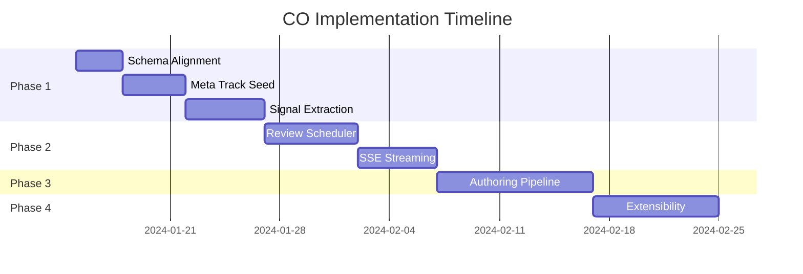

# Curriculum Orchestrator Implementation Roadmap

## Sprint Overview

This roadmap outlines the implementation strategy for the Curriculum Orchestrator (CO) Meta coding interview preparation feature and extensibility framework.

## Priority Classification

- **P0 - Critical**: Must have for basic functionality
- **P1 - High**: Important for MVP launch
- **P2 - Medium**: Enhances user experience 
- **P3 - Low**: Future enhancements

## Implementation Phases

### Phase 1: Foundation (Sprint 1) - 2 weeks
**Goal**: Establish stable foundation and basic Meta track functionality

#### Week 1: Core Infrastructure
1. **CO-001: Database Schema Alignment** (P0)
   - **Effort**: 2-3 hours
   - **Owner**: Backend Team
   - **Prerequisites**: None
   - **Output**: Aligned models and migrations

2. **CO-002: Meta Track Seed Data** (P0) 
   - **Effort**: 5-6 hours
   - **Owner**: Content Team + Backend
   - **Prerequisites**: CO-001
   - **Output**: 48 seed problems across 13 modules (LeetCode-aligned)

#### Week 2: Signal Extraction
3. **CO-003: Meta Signal Extraction** (P1)
   - **Effort**: 4-5 hours  
   - **Owner**: Backend Team
   - **Prerequisites**: CO-001, CO-002
   - **Output**: 5-pillar scoring for Meta problems

### Phase 2: User Experience (Sprint 2) - 2 weeks
**Goal**: Complete user-facing features for Meta track

#### Week 3: Scheduling & Retention
4. **CO-004: Spaced Review Scheduler** (P1)
   - **Effort**: 5-6 hours
   - **Owner**: Backend Team  
   - **Prerequisites**: CO-001
   - **Output**: Background task system for review scheduling

#### Week 4: Real-time Interaction
5. **CO-006: SSE Streaming Implementation** (P2)
   - **Effort**: 4-5 hours
   - **Owner**: Backend Team
   - **Prerequisites**: CO-001
   - **Output**: Real-time tutor streaming

### Phase 3: Content Pipeline (Sprint 3) - 2 weeks
**Goal**: Scale content creation and ensure quality

#### Week 5-6: Content Authoring
6. **CO-005: Problem Authoring Pipeline** (P1)
   - **Effort**: 8-10 hours
   - **Owner**: Backend Team + Content Team
   - **Prerequisites**: CO-002
   - **Output**: LLM-assisted problem generation with QA

### Phase 4: Extensibility (Sprint 4) - 2 weeks  
**Goal**: Enable support for additional subjects

#### Week 7-8: Framework Architecture
7. **CO-007: Subject Extensibility Framework** (P2)
   - **Effort**: 6-8 hours
   - **Owner**: Architecture Team
   - **Prerequisites**: CO-003 
   - **Output**: Plugin system for new subjects

## Detailed Implementation Schedule

## Risk Assessment & Mitigation

### High-Risk Items

1. **Schema Migration (CO-001)**
   - **Risk**: Data loss or downtime during migration
   - **Mitigation**: Test on staging, backup production data, rollback plan

2. **LLM Integration (CO-005)**
   - **Risk**: API rate limits, cost overruns, quality issues
   - **Mitigation**: Implement caching, set budget limits, human review required

3. **Real-time Streaming (CO-006)**
   - **Risk**: Connection stability, scaling issues
   - **Mitigation**: Fallback to polling, load testing, connection limits

### Dependencies

- **External Services**: OpenAI API, Redis, Problem Bank service
- **Team Coordination**: Content team for problem creation, Frontend team for UI
- **Infrastructure**: Database migration window, Redis deployment

## Success Metrics

### Phase 1 Success Criteria
- [ ] All database operations complete without errors
- [ ] 48 Meta problems accessible via API (LeetCode-aligned curriculum)
- [ ] Pillar scores returned for Meta submissions
- [ ] All 13 modules properly sequenced and accessible

### Phase 2 Success Criteria  
- [ ] Users receive review notifications
- [ ] Real-time hint streaming functional
- [ ] Session completion rates improve by 15%

### Phase 3 Success Criteria
- [ ] Content team can generate 10 problems/day
- [ ] 95% of generated problems pass QA
- [ ] Problem bank grows to 100+ problems

### Phase 4 Success Criteria
- [ ] UIUC Math plugin functional
- [ ] New subject can be added in <4 hours
- [ ] Plugin architecture documented

## Resource Requirements

### Team Allocation
- **Backend Engineers**: 2 FTE across all phases
- **Content Engineers**: 1 FTE for Phases 1-3  
- **Frontend Engineers**: 0.5 FTE for integration
- **DevOps**: 0.25 FTE for infrastructure

### Infrastructure
- **Development**: Redis cluster, staging database
- **Production**: High-availability Redis, database replica
- **Monitoring**: Additional telemetry for streaming endpoints

### Budget
- **OpenAI API**: ~$500/month for problem generation
- **Infrastructure**: ~$200/month additional cost
- **Third-party Tools**: Problem validation services

## Post-Launch Plan

### Immediate (Weeks 9-10)
- Monitor user engagement metrics
- Gather feedback on Meta track experience  
- Performance optimization
- Bug fixes and stability improvements

### Short-term (Months 2-3)
- Add remaining 4 Meta modules (difficulty 4-5)
- Implement mock interview mode
- A/B test different hint strategies
- Scale to 500+ problems

### Medium-term (Months 4-6)
- Launch UIUC Math subject
- Add 2-3 additional company tracks (Google, Amazon)
- Implement cross-subject analytics
- Mobile app integration

### Long-term (6+ months)
- AI-powered personalization
- Video explanation integration
- Collaborative problem solving
- Enterprise/university partnerships

## Communication Plan

### Weekly Standups
- Progress on current sprint tickets
- Blocker identification and resolution
- Cross-team coordination needs

### Sprint Reviews
- Demo completed features to stakeholders
- Gather feedback and adjust priorities
- Plan upcoming sprint work

### Monthly All-hands
- Share progress with broader organization
- Celebrate milestones and learnings
- Align on strategic direction

## Quality Assurance

### Testing Strategy
- **Unit Tests**: 80%+ coverage for new code
- **Integration Tests**: Full API workflow testing
- **Load Tests**: Streaming endpoints under stress
- **User Acceptance**: Beta testing with 50 users

### Code Review Process
- All PRs require 2 approvals
- Architecture review for significant changes
- Security review for external integrations
- Performance review for database changes

### Deployment Strategy
- **Feature Flags**: Gradual rollout capability
- **Blue-Green**: Zero-downtime deployments
- **Monitoring**: Real-time alerts and dashboards
- **Rollback**: Automated rollback triggers

## Conclusion

This roadmap balances ambitious feature development with practical implementation constraints. The phased approach allows for iterative feedback and course correction while building toward a robust, extensible platform.

The foundation phase ensures stability, the user experience phase validates product-market fit, the content pipeline phase enables scale, and the extensibility phase positions for long-term growth across multiple subjects and institutions.